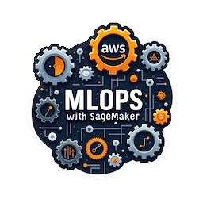
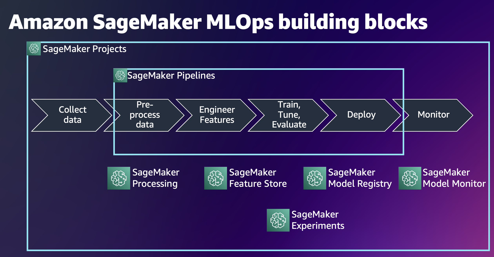

# 	Predict customer subscription for bank term deposit using Amazon Sage Maker

Each notebook helps with different steps in the lifecycle of a model, from experimentation to deployment, as well as monitoring and retraining.

## 📄 Description

This project aims to predict whether a client will subscribe to a bank term deposit based on data collected from direct marketing campaigns conducted by a Portuguese banking institution. The marketing campaigns primarily involved phone calls to clients, and multiple contacts were often required to determine whether a client would subscribe to the product or not.

## 🔍Classification Goal
The classification task in this project is to predict whether a client will subscribe to a bank term deposit (y = "yes") or not (y = "no") based on the features provided. This task will help the bank identify clients who are more likely to subscribe to a term deposit, optimizing future marketing efforts and improving campaign efficiency.

## Implementation Details
1. Exploratory Data Analysis & Feature Engineering:
Performed comprehensive Exploratory Data Analysis (EDA) and Feature Engineering in notebook 1 to understand the dataset and create relevant features for the model.
2. Preprocessing & Model Training:
Performed data preprocessing using the SageMaker scikit-learn preprocessing job, and trained an XGBoost model using the SageMaker XGBoost Estimator in notebook 2. Experiment tracking was managed through SageMaker MLflow experiment tracker to monitor model performance and hyperparameters. 
3.  Traning Pipeline  & Model Registry
Prepared a model training pipeline and registered the model in the SageMaker Model Registry if its performance exceeded that of previously registered models. Stored baseline statistics for both data and model to use it in model monitoring. Explored the use of SageMaker Feature Store to store evaluated dataset features and utilized these features as a data source in the training pipeline. Notebook 3.
4.  CI/CD pipeline
Created a SageMaker project and streamlined the use of the training pipeline, establishing a CI/CD pipeline for both training and deployment in Notebook 4 and Notebook 5. Set up an inference pipeline for the deployed model using SageMaker PipelineModel. The preprocessing is managed by a scikit-learn preprocessing model created in script mode, while inference is handled by an XGBoost model. Both models were deployed as separate containers within a single endpoint instance.

5. Model monitoring & Monitoring schedule
Added monitoring for both data and model, tracking various properties such as data quality, data drift, and model drift. Set up a monitoring schedule for the deployed model on an hourly basis. Configured CloudWatch and EventBridge rules to automatically trigger the retraining pipeline if the model quality (e.g., accuracy) falls below a defined threshold.

## 🛠️ CI/CD Repository Links:
1. [Training/CI pipeline](https://github.com/rinkusahu1/sage-maker-ci-cd-pipeline-customer-churn-pred)
2. [Deployment/CD Pipeline](https://github.com/rinkusahu1/sage-maker-ci-cd-pipeline-customer-churn-pred/tree/deploy)

## ⚡️ Important Tips:
1. Avoid Using SageMaker MLFlow Tracking:
SageMaker’s built-in MLFlow pipeline tracking can be costly and slow to start/stop. Instead, deploy MLFlow on an EC2 instance for efficient experiment tracking.

# 🐞 Debugging Tips:
1. When creating a SageMaker project, it’s important to ensure that the necessary permissions are correctly assigned. Most of the permission issues I encountered when creating a SageMaker project are related to the following roles:

AmazonSageMakerServiceCatalogProductsCodePipelineRole: Required for managing the SageMaker pipeline within AWS CodePipeline.
AmazonSageMakerServiceCatalogProductsCodeBuildRole: Needed for integrating with AWS CodeBuild to build and test SageMaker projects.
AmazonSageMakerServiceCatalogProductsLaunchRole: Essential for launching and managing resources in SageMaker during project execution.
2. CI/CD Pipeline Debugging:
When creating or testing CI/CD pipelines, review the logs in CodeBuild, CodeDeploy, and Pipeline sections to diagnose issues effectively.

## References 📚

1. [Amazon SageMaker MLOps: from idea to production in six steps.](https://catalog.us-east-1.prod.workshops.aws/workshops/741835d3-a2bf-4cb6-81f0-d0bb4a62edca/en-US/01-lab-01).

2. [Sage Maker Learning Resource. (YouTube Video)](https://www.youtube.com/watch?v=uQc8Itd4UTs&list=PLhr1KZpdzukcOr_6j_zmSrvYnLUtgqsZz). 

